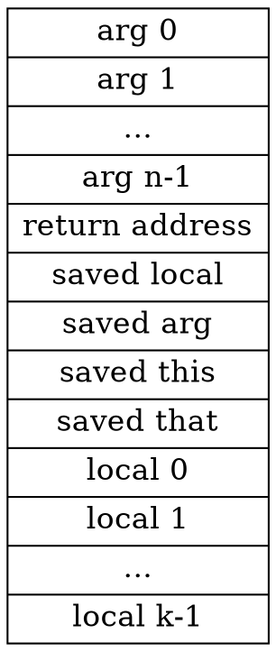

# Command

The VM language consists of four types of commands:

* Arithmetic commands: perform arithmetic and logical operations on the stack.

* Memory access commands: transfer data between the stack and virtual memory
segments.

* Program flow commands: facilitate conditional and unconditional branching
operations.

* Function calling commands: call functions and return from them.

## Arithmetic and Logical Commands

The VM language features **nine** stack-oriented arithmetic and logical commands.

**Seven** of these commands are binary: They pop two items off the stack, compute a binary function on them, and push the result back onto the stack. 

The remaining **two** commands are unary: they pop a single item off the stack, compute a unary function on it, and push the result back onto the stack.

### Integer Addition

```typescript
export class Add {}
```

```typescript
<Add /> +
    function Execute(vm: IVirtualMachine) {
        <PopTwoItems />;
        <PushSum />;
        <IncrementPC />;
    };
```

### Integer Subtraction

```typescript
export class Subtract {}
```

```typescript
<Subtract /> +
    function Execute(vm: IVirtualMachine) {
        <PopTwoItems />;
        <PushDifference />;
        <IncrementPC />;
    };
```

### Equality

```typescript
export class Equality {}
```

```typescript
<Equality /> +
    function Execute(vm: IVirtualMachine) {
        <PopTwoItems />;
        <PushEquality />;
        <IncrementPC />;
    };
```

### Greater Than

```typescript
export class GreaterThan {}
```

```typescript
<GreaterThan /> +
    function Execute(vm: IVirtualMachine) {
        <PopTwoItems />;
        <PushGreaterThanResult />;
        <IncrementPC />;
    };
```

### Less Than

```typescript
export class LessThan {}
```

```typescript
<LessThan /> +
    function Execute(vm: IVirtualMachine) {
        <PopTwoItems />;
        <PushLessThanResult />;
        <IncrementPC />;
    };
```

### Bitwise And

```typescript
export class And {}
```

```typescript
<And /> +
    function Execute(vm: IVirtualMachine) {
        <PopTwoItems />;
        <PushBitwiseAnd />;
        <IncrementPC />;
    };
```

### Bitwise Or

```typescript
export class Or {}
```

```typescript
<Or /> +
    function Execute(vm: IVirtualMachine) {
        <PopTwoItems />;
        <PushBitwiseOr />;
        <IncrementPC />;
    };
```

### Arithmetic Negation

```typescript
export class Negate {}
```

```typescript
<Negate /> +
    function Execute(vm: IVirtualMachine) {
        <PopOneItem />;
        <PushNegateResult />;
        <IncrementPC />;
    };
```

### Bitwise Not

```typescript
export class Not {}
```

```typescript
<Not /> +
    function Execute(vm: IVirtualMachine) {
        <PopOneItem />;
        <PushBitwiseNot />;
        <IncrementPC />;
    };
```

## Memory Access Commands

All the memory segments are accessed by the same two commands:

* push *segment index*: Push the value of segment[index] onto the stack.

* pop *segment index*: Pop the top stack value and store it in segment[index].

### Push

```typescript
export class Push {
    m_Segment: SegmentType;
    m_Index: number;
}
```

```typescript
<Push /> +
    function Execute(this: Push, vm: IVirtualMachine) {
        vm.m_Stack.push(this.m_Segment, this.m_Index);
        <IncrementPC />;
    };
```

### Pop

```typescript
export class Pop {
    m_Segment: SegmentType;
    m_Index: number;
}
```

```typescript
<Pop /> +
    function Execute(this: Pop, vm: IVirtualMachine) {
        vm.m_Stack.pop(this.m_Segment, this.m_Index);
        <IncrementPC />;
    };
```

## Program Flow Commands

* label *symbol* : Label declaration

* goto *symbol* : Unconditional branching

* if-goto *symbol* : Conditional branching

### Label

```typescript
export class Label {
    m_Label: string;
    m_Pos: number;
}
```

```typescript
<Label /> +
    function Execute(this: Label, vm: IVirtualMachine) {
        vm.RegisterLabel(this.m_Label, this.m_Pos);
    };
```

### Goto

```typescript
export class Goto {
    m_Label: string;
}
```

```typescript
<Goto /> +
    function Execute(this: Goto, vm: IVirtualMachine) {
        <JumpToLabel />;
    };
```

### If Goto

```typescript
export class IfGoto {
    m_Label: string;
}
```

```typescript
<IfGoto /> +
    function Execute(this: IfGoto, vm: IVirtualMachine) {
        <CheckIfJump />;
    };
```

## Function Calling Commands

* function *functionName nLocals* : Function declaration, specifying the number of the function’s local variables

* call *functionName nArgs* : Function invocation, specifying the number of the function’s arguments

* return : Transfer control back to the calling function

### Function

```typescript
export class DeclareFunction {
    m_Label: ILabel;
    m_LocalCount: number;
}
```

```typescript
<DeclareFunction /> +
    function Execute(this: DeclareFunction, vm: IVirtualMachine) {
        for (let i = 0; i < this.m_LocalCount; ++i) {
            vm.m_Stack.push("constant", 0);
        }
        <IncrementPC />;
    };
```

### Call

The convention of function call:



```typescript
export class Call {
    m_Label: string;
    m_ArgCount: number;
}
```

```typescript
<Call /> +
    function Execute(this: Call, vm: IVirtualMachine) {
        /**
         * push return address
         */
        vm.m_Stack.push("constant", vm.m_PC + 1);
        vm.m_Stack.push("constant", vm.m_Memory.Read(MemoryAddress.Local));
        vm.m_Stack.push("constant", vm.m_Memory.Read(MemoryAddress.Argument));
        vm.m_Stack.push("constant", vm.m_Memory.Read(MemoryAddress.This));
        vm.m_Stack.push("constant", vm.m_Memory.Read(MemoryAddress.That));

        /**
         * Reposition arg
         */
        vm.m_Memory.Write(MemoryAddress.Argument, vm.m_Stack.sp() - this.m_ArgCount - 5);

        /**
         * Reposition local
         */
        vm.m_Memory.Write(MemoryAddress.Local, vm.m_Stack.sp());
        <JumpToLabel />;
    };
```

### Return

```typescript
export class Return {}
```

```typescript
<Return /> +
    function Execute(this: Return, vm: IVirtualMachine) {
        const local_base = vm.m_Memory.Read(MemoryAddress.Local);
        <PrepareReturnAddress />;
        <PrepareReturnValue />;
        <RestoreSavedBaseAddresses />;
        <GoToReturnAddress />;
    };
```

# Appendix

## Trivial

```typescript
<Pop /> +
    function constructor(this: Pop, segment: SegmentType, index: number) {
        this.m_Segment = segment;
        this.m_Index = index;
    };
```

```typescript
<Push /> +
    function constructor(this: Push, segment: SegmentType, index: number) {
        this.m_Segment = segment;
        this.m_Index = index;
    };
```

```typescript
<Label /> +
    function constructor(this: Label, label: string) {
        this.m_Label = label;
        this.m_Pos = null;
    };
```

```typescript
<Goto /> +
    function constructor(this: Goto, label: string) {
        this.m_Label = label;
    };
```

```typescript
<IfGoto /> +
    function constructor(this: IfGoto, label: string) {
        this.m_Label = label;
    };
```

```typescript
<Call /> +
    function constructor(this: Call, label: string, arg_count: number) {
        this.m_Label = label;
        this.m_ArgCount = arg_count;
    };
```

```typescript
<DeclareFunction /> +
    function constructor(this: DeclareFunction, label: string, local_count: number) {
        this.m_Label = Reflect.construct(Label, [label]);
        this.m_LocalCount = local_count;
    };
```

## Utility

```typescript
export interface ILabel extends ICommand {
    SetPos(pos: number): void;
    Register(vm: IVirtualMachine, pos: number): void;
}
```

```typescript
<Label /> +
    function SetPos(this: Label, pos: number) {
        this.m_Pos = pos;
    };
```

```typescript
<Label /> +
    function Register(this: Label & ILabel, vm: IVirtualMachine, pos: number) {
        this.SetPos(pos);
        this.Execute(vm);
    };
```

```typescript
<DeclareFunction /> +
    function RegisterLabel(this: DeclareFunction, vm: IVirtualMachine, pos: number) {
        this.m_Label.Register(vm, pos);
    };
```

## Local Context

take value at top of stack, if equals 0, continue execution

```typescript
function CheckIfJump(vm: IVirtualMachine) {
    const top = vm.m_Stack.pop();
    if (top === 0) {
        <IncrementPC />;
        return;
    }
    <JumpToLabel />;
}
```

```typescript
function JumpToLabel(this: { m_Label: string }, vm: IVirtualMachine) {
    const address = vm.ResolveLabel(this.m_Label);
    vm.Jump(address);
}
```

```typescript
function PrepareReturnAddress(vm: IVirtualMachine, local_base: number) {
    const return_address = vm.m_Memory.Read(local_base - 5);
}
```

the convention is to put return value at the pos of first arg after return

```typescript
function PrepareReturnValue(vm: IVirtualMachine) {
    const return_value = vm.m_Stack.pop();
    vm.m_Memory.Write(vm.m_Memory.Resolve("argument", 0), return_value);
}
```

saved base addresses just like registers

```typescript
function RestoreSavedBaseAddresses(vm: IVirtualMachine, local_base: number) {
    /**
     * restore sp to pos of arg+1, because after return we will put return value at arg
     */
    vm.m_Memory.Write(MemoryAddress.StackPointer, vm.m_Memory.Read(MemoryAddress.Argument) + 1);
    vm.m_Memory.Write(MemoryAddress.That, vm.m_Memory.Read(local_base - 1));
    vm.m_Memory.Write(MemoryAddress.This, vm.m_Memory.Read(local_base - 2));
    vm.m_Memory.Write(MemoryAddress.Argument, vm.m_Memory.Read(local_base - 3));
    vm.m_Memory.Write(MemoryAddress.Local, vm.m_Memory.Read(local_base - 4));
}
```

```typescript
function GoToReturnAddress(vm: IVirtualMachine, return_address: number) {
    vm.Jump(return_address);
}
```

```typescript
function IncrementPC(vm: IVirtualMachine) {
    vm.m_PC += 1;
}
```

```typescript
function PopTwoItems(vm: IVirtualMachine) {
    const stack = vm.m_Stack;
    const y = stack.pop();
    const x = stack.pop();
}
```

```typescript
function PopOneItem(vm: IVirtualMachine) {
    const stack = vm.m_Stack;
    const y = stack.pop();
}
```

```typescript
function PushSum(stack: IStack, x: number, y: number) {
    stack.push("constant", x + y);
}
```

```typescript
function PushDifference(stack: IStack, x: number, y: number) {
    stack.push("constant", x - y);
}
```

```typescript
function PushNegateResult(stack: IStack, y: number) {
    stack.push("constant", -y);
}
```

```typescript
function PushEquality(stack: IStack, x: number, y: number) {
    stack.push("constant", x === y ? Boolean.True : Boolean.False);
}
```

```typescript
function PushLessThanResult(stack: IStack, x: number, y: number) {
    stack.push("constant", x < y ? Boolean.True : Boolean.False);
}
```

```typescript
function PushGreaterThanResult(stack: IStack, x: number, y: number) {
    stack.push("constant", x > y ? Boolean.True : Boolean.False);
}
```

```typescript
function PushBitwiseAnd(stack: IStack, x: number, y: number) {
    stack.push("constant", x & y);
}
```

```typescript
function PushBitwiseOr(stack: IStack, x: number, y: number) {
    stack.push("constant", x | y);
}
```

```typescript
function PushBitwiseNot(stack: IStack, y: number) {
    stack.push("constant", ~y);
}
```